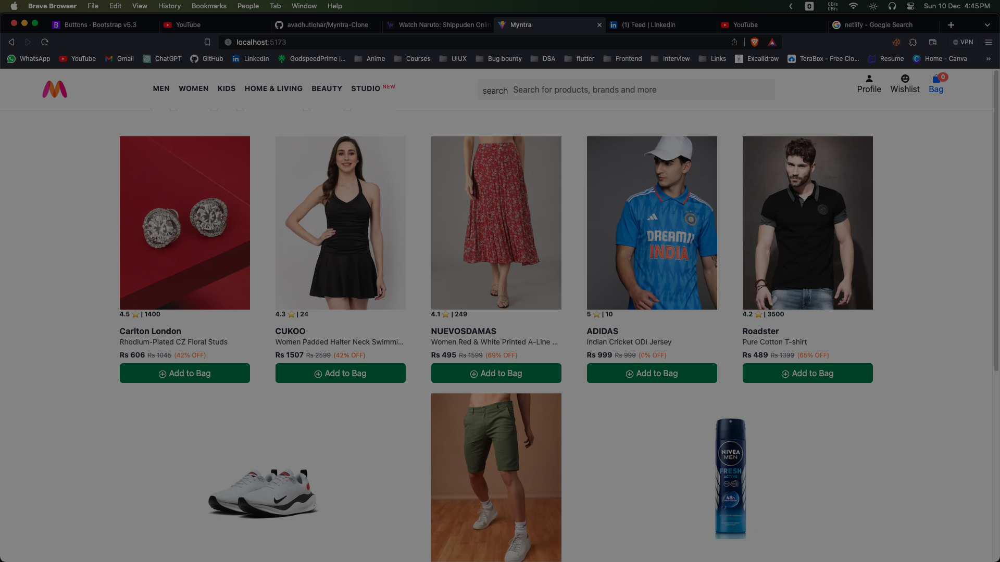
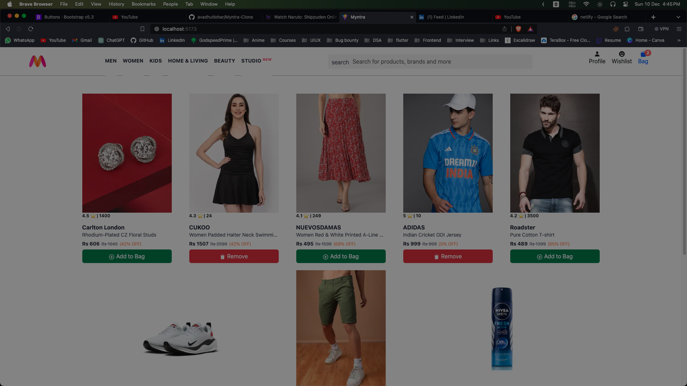
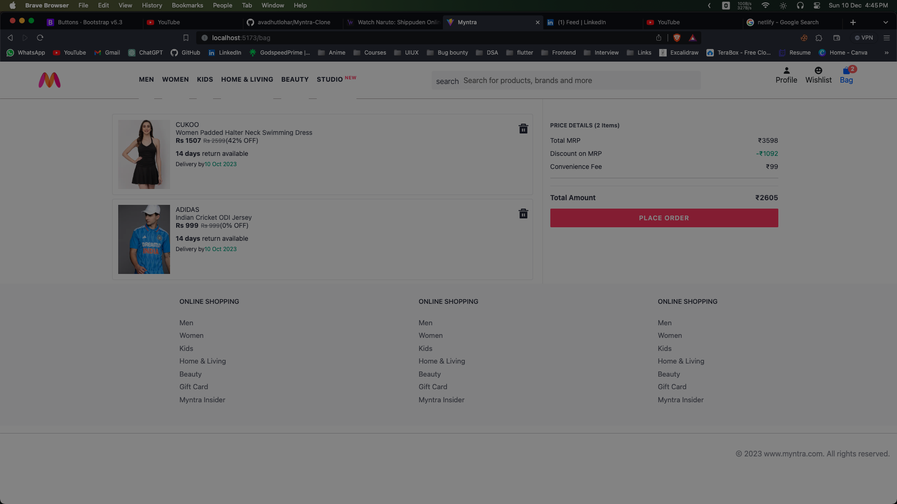

# Myntra Clone

## Tech Stack:

	•	React: A JavaScript library for building user interfaces.
	•	React Router DOM: Enables navigation in a React web application.
	•	Redux Toolkit: A set of tools for efficient Redux development.
	•	Bootstrap: A front-end framework for developing responsive and mobile-first websites.

